# Manual Completo de Pruebas de Servicios Web SOAP SUNAT con SoapUI

Este documento sirve como guía paso a paso ("con manzanitas") para comprender, configurar y probar cada una de las operaciones expuestas por los servicios web SOAP de la SUNAT en su ambiente de pruebas (Beta), utilizando la herramienta **SoapUI**.

---

## ¿Qué es un CPE?
Un **Comprobante de Pago Electrónico (CPE)** es todo documento regulado por la SUNAT que se emite en formato digital (XML UBL 2.1) y que acredita la transferencia de bienes, entrega en uso o prestación de servicios.

### Tipos de CPE y Documentos de Comunicación

| Tipo de CPE | Descripción |
| :--- | :--- |
| **Factura** | Comprobante emitido a empresas con RUC (derecho a crédito fiscal). |
| **Boleta de Venta** | Comprobante emitido generalmente a consumidores finales (sin RUC). |
| **Nota de Crédito** | Corrige, anula o realiza descuentos sobre un comprobante previamente emitido. |
| **Nota de Débito** | Incrementa el importe o penalidades asociadas a un comprobante emitido. |
| **Resumen Diario** | Declaración agrupada de boletas de venta emitidas o anuladas durante el día. |
| **Comunicación de Baja** | Declaración para dar de baja/anular facturas o notas de crédito/débito. |

### Flujo General de la Facturación Electrónica

```mermaid
graph LR
    Sistema[1. Tu Sistema] -->|Genera| XML[2. XML UBL]
    XML -->|Firma Digital| Firmado[3. XML Firmado]
    Firmado -->|Comprime| ZIP[4. Archivo ZIP]
    ZIP -->|SOAP Request| SUNAT[5. Servidor SOAP SUNAT]
    SUNAT -->|Valida| Proceso[6. Validación SUNAT]
    Proceso -->|SOAP Response| CDR[7. CDR en ZIP Base64]
    CDR -->|Procesa| Resultado[8. CDR Aceptado/Rechazado]
```



### Documentación Oficial Utilizada
- [Guías y Manuales SUNAT](https://cpe.sunat.gob.pe/guias-y-manuales)
- [Guía XML Factura UBL 2.1](https://cpe.sunat.gob.pe/sites/default/files/inline-files/guia+xml+factura+version%202-1+1+0%20(2)_0%20(2).pdf)
- [Manual del Programador SUNAT](https://cpe.sunat.gob.pe/sites/default/files/inline-files/manual_programador%20(1).pdf)
- [Pautas del Servicio Beta de SUNAT](https://orientacion.sunat.gob.pe/12-pautas-servicio-beta)
- [Servicios Web Disponibles de SUNAT](https://cpe.sunat.gob.pe/sites/default/files/2026-05/Descarga%20aqu%C3%AD%20los%20Servicios%20WEB%20Disponibles%20-%20Incluye%20DDJJ%20de%20Boletos%20a%C3%A9reos.pdf)

---

## Servicios Web SOAP

**SOAP (Simple Object Access Protocol)** es un protocolo de comunicación basado en XML que permite el intercambio estructurado de información entre aplicaciones a través de servicios web, generalmente mediante HTTP/HTTPS.

### Arquitectura de Comunicación
```text
Aplicación (SoapUI / Java)
        ↓
    [SOAP Request] (Envía sobre XML firmado + Credenciales)
        ↓
Servicio Web SUNAT (e-beta / e-factura)
        ↓
    [Validación de Reglas de Negocio]
        ↓
    [SOAP Response] (Retorna CDR o Ticket)
        ↓
Aplicación (SoapUI / Java)
```

### Ambientes de Trabajo

| Ambiente | Uso | Endpoint (Dirección de Envío) |
| :--- | :--- | :--- |
| **Beta** | Pruebas y desarrollo. | Se obtiene del WSDL del ambiente de pruebas. |
| **Producción** | Envío real y oficial. | Se obtiene del WSDL del ambiente productivo. |

### Autenticación (WS-Security UsernameToken)
Los servicios SOAP de SUNAT utilizan **WS-Security** para validar la identidad del emisor. La cabecera viaja dentro del tag `<soapenv:Header>` encapsulando un `UsernameToken`:

- **Usuario SOL (Username)**: Concatenación del **RUC** + **Usuario SOL secundario**.
  - *En Beta:* `20000000001MODDATOS` (RUC de pruebas + usuario MODDATOS).
- **Contraseña (Password)**: Clave SOL del usuario secundario.
  - *En Beta:* `moddatos`

---

## Preparación del Ambiente de Pruebas (Linux)

Para generar a mano un archivo zip codificado en Base64 para cargarlo en SoapUI, ejecuta los siguientes comandos en tu terminal de Linux:

### Paso 1: Crear la carpeta de pruebas
```bash
mkdir ~/prueba_boleta && cd ~/prueba_boleta
```

### Paso 2: Crear el archivo XML de prueba
Crea un archivo llamado `boleta.xml`:
```bash
nano boleta.xml
```
Pega el siguiente contenido XML simplificado:
```xml
<?xml version="1.0" encoding="ISO-8859-1" standalone="no"?>
<Invoice xmlns="urn:oasis:names:specification:ubl:schema:xsd:Invoice-2" xmlns:cac="urn:oasis:names:specification:ubl:schema:xsd:CommonAggregateComponents-2" xmlns:cbc="urn:oasis:names:specification:ubl:schema:xsd:CommonBasicComponents-2" xmlns:ds="http://www.w3.org/2000/09/xmldsig#" xmlns:ext="urn:oasis:names:specification:ubl:schema:xsd:CommonExtensionComponents-2" xmlns:xsi="http://www.w3.org/2001/XMLSchema-instance">
   <ext:UBLExtensions>
      <ext:UBLExtension>
         <ext:ExtensionContent>
            <ds:Signature>
               <ds:SignedInfo>
                  <ds:CanonicalizationMethod Algorithm="http://www.w3.org/TR/2001/REC-xml-c14n-20010315"/>
                  <ds:SignatureMethod Algorithm="http://www.w3.org/2000/09/xmldsig#rsa-sha1"/>
                  <ds:Reference URI="">
                     <ds:Transforms>
                        <ds:Transform Algorithm="http://www.w3.org/2000/09/xmldsig#enveloped-signature"/>
                     </ds:Transforms>
                     <ds:DigestMethod Algorithm="http://www.w3.org/2000/09/xmldsig#sha1"/>
                     <ds:DigestValue></ds:DigestValue>
                  </ds:Reference>
               </ds:SignedInfo>
               <ds:SignatureValue></ds:SignatureValue>
               <ds:KeyInfo>
                  <ds:X509Data>
                     <ds:X509Certificate></ds:X509Certificate>
                  </ds:X509Data>
               </ds:KeyInfo>
            </ds:Signature>
         </ext:ExtensionContent>
      </ext:UBLExtension>
   </ext:UBLExtensions>
   <cbc:UBLVersionID>2.1</cbc:UBLVersionID>
   <cbc:CustomizationID>2.0</cbc:CustomizationID>
   <cbc:ID>B001-1</cbc:ID>
   <cbc:IssueDate>2026-07-06</cbc:IssueDate>
   <cbc:IssueTime>10:00:00</cbc:IssueTime>
   <cbc:InvoiceTypeCode listID="0101" listAgencyName="PE:SUNAT" listName="Tipo de Documento" listURI="urn:pe:gob:sunat:cpe:see:gem:catalogos:catalogo01">03</cbc:InvoiceTypeCode>
   <cbc:Note languageLocaleID="1000">CIENTO DIECIOCHO CON 00/100 SOLES</cbc:Note>
   <cbc:DocumentCurrencyCode listID="ISO 4217 Alpha" listName="Currency" listAgencyName="United Nations Economic Commission for Europe">PEN</cbc:DocumentCurrencyCode>
   <cac:Signature>
      <cbc:ID>20000000001</cbc:ID>
      <cac:SignatoryParty>
         <cac:PartyIdentification>
            <cbc:ID>20000000001</cbc:ID>
         </cac:PartyIdentification>
         <cac:PartyName>
            <cbc:Name><![CDATA[EMPRESA DE PRUEBA SAC]]></cbc:Name>
         </cac:PartyName>
      </cac:SignatoryParty>
      <cac:DigitalSignatureAttachment>
         <cac:ExternalReference>
            <cbc:URI>20000000001</cbc:URI>
         </cac:ExternalReference>
      </cac:DigitalSignatureAttachment>
   </cac:Signature>
   <cac:AccountingSupplierParty>
      <cac:Party>
         <cac:PartyIdentification>
            <cbc:ID schemeID="6">20000000001</cbc:ID>
         </cac:PartyIdentification>
         <cac:PartyName>
            <cbc:Name><![CDATA[EMPRESA DE PRUEBA SAC]]></cbc:Name>
         </cac:PartyName>
         <cac:PartyLegalEntity>
            <cbc:RegistrationName><![CDATA[EMPRESA DE PRUEBA SAC]]></cbc:RegistrationName>
            <cac:RegistrationAddress>
               <cbc:ID schemeName="Ubigeos" schemeAgencyName="PE:INEI">150101</cbc:ID>
               <cbc:AddressTypeCode listAgencyName="PE:SUNAT" listName="Establecimientos anexos">0000</cbc:AddressTypeCode>
               <cbc:CityName>LIMA</cbc:CityName>
               <cbc:CountrySubentity>LIMA</cbc:CountrySubentity>
               <cbc:District>LIMA</cbc:District>
               <cac:AddressLine>
                  <cbc:Line>AV. PRUEBA 123</cbc:Line>
               </cac:AddressLine>
               <cac:Country>
                  <cbc:IdentificationCode listID="ISO 3166-1" listAgencyName="United Nations Economic Commission for Europe" listName="Country">PE</cbc:IdentificationCode>
               </cac:Country>
            </cac:RegistrationAddress>
         </cac:PartyLegalEntity>
      </cac:Party>
   </cac:AccountingSupplierParty>
   <cac:AccountingCustomerParty>
      <cac:Party>
         <cac:PartyIdentification>
            <cbc:ID schemeID="1" schemeName="Documento de Identidad" schemeAgencyName="PE:SUNAT" schemeURI="urn:pe:gob:sunat:cpe:see:gem:catalogos:catalogo06">12345678</cbc:ID>
         </cac:PartyIdentification>
         <cac:PartyLegalEntity>
            <cbc:RegistrationName><![CDATA[CLIENTE DE PRUEBA]]></cbc:RegistrationName>
         </cac:PartyLegalEntity>
      </cac:Party>
   </cac:AccountingCustomerParty>
   <cac:PaymentTerms>
      <cbc:ID>FormaPago</cbc:ID>
      <cbc:PaymentMeansID>Contado</cbc:PaymentMeansID>
   </cac:PaymentTerms>
   <cac:TaxTotal>
      <cbc:TaxAmount currencyID="PEN">18.00</cbc:TaxAmount>
      <cac:TaxSubtotal>
         <cbc:TaxableAmount currencyID="PEN">100.00</cbc:TaxableAmount>
         <cbc:TaxAmount currencyID="PEN">18.00</cbc:TaxAmount>
         <cac:TaxCategory>
            <cac:TaxScheme>
               <cbc:ID schemeName="Codigo de tributos" schemeAgencyName="PE:SUNAT" schemeURI="urn:pe:gob:sunat:cpe:see:gem:catalogos:catalogo05">1000</cbc:ID>
               <cbc:Name>IGV</cbc:Name>
               <cbc:TaxTypeCode>VAT</cbc:TaxTypeCode>
            </cac:TaxScheme>
         </cac:TaxCategory>
      </cac:TaxSubtotal>
   </cac:TaxTotal>
   <cac:LegalMonetaryTotal>
      <cbc:LineExtensionAmount currencyID="PEN">100.00</cbc:LineExtensionAmount>
      <cbc:TaxInclusiveAmount currencyID="PEN">118.00</cbc:TaxInclusiveAmount>
      <cbc:AllowanceTotalAmount currencyID="PEN">0.00</cbc:AllowanceTotalAmount>
      <cbc:ChargeTotalAmount currencyID="PEN">0.00</cbc:ChargeTotalAmount>
      <cbc:PrepaidAmount currencyID="PEN">0.00</cbc:PrepaidAmount>
      <cbc:PayableAmount currencyID="PEN">118.00</cbc:PayableAmount>
   </cac:LegalMonetaryTotal>
   <cac:InvoiceLine>
      <cbc:ID>1</cbc:ID>
      <cbc:InvoicedQuantity unitCode="NIU">1.00</cbc:InvoicedQuantity>
      <cbc:LineExtensionAmount currencyID="PEN">100.00</cbc:LineExtensionAmount>
      <cac:PricingReference>
         <cac:AlternativeConditionPrice>
            <cbc:PriceAmount currencyID="PEN">118.00</cbc:PriceAmount>
            <cbc:PriceTypeCode listName="Tipo de Precio" listAgencyName="PE:SUNAT" listURI="urn:pe:gob:sunat:cpe:see:gem:catalogos:catalogo16">01</cbc:PriceTypeCode>
         </cac:AlternativeConditionPrice>
      </cac:PricingReference>
      <cac:TaxTotal>
         <cbc:TaxAmount currencyID="PEN">18.00</cbc:TaxAmount>
         <cac:TaxSubtotal>
            <cbc:TaxableAmount currencyID="PEN">100.00</cbc:TaxableAmount>
            <cbc:TaxAmount currencyID="PEN">18.00</cbc:TaxAmount>
            <cac:TaxCategory>
               <cbc:Percent>18</cbc:Percent>
               <cbc:TaxExemptionReasonCode>10</cbc:TaxExemptionReasonCode>
               <cac:TaxScheme>
                  <cbc:ID>1000</cbc:ID>
                  <cbc:Name>IGV</cbc:Name>
                  <cbc:TaxTypeCode>VAT</cbc:TaxTypeCode>
               </cac:TaxScheme>
            </cac:TaxCategory>
         </cac:TaxSubtotal>
      </cac:TaxTotal>
      <cac:Item>
         <cbc:Description><![CDATA[PRODUCTO DE PRUEBA]]></cbc:Description>
      </cac:Item>
      <cac:Price>
         <cbc:PriceAmount currencyID="PEN">100.00</cbc:PriceAmount>
      </cac:Price>
   </cac:InvoiceLine>
</Invoice>
```
Guarda y sal con `Ctrl+O`, `Enter`, y `Ctrl+X`.

### Paso 3: Firmar digitalmente el XML
```bash
xmlsec1 --sign --privkey-pem server_key.pem,server.pem --output 20000000001-03-B001-1.xml boleta.xml
```

### Paso 4: Verificar la firma
```bash
xmlsec1 --verify --pubkey-cert-pem server.pem 20000000001-03-B001-1.xml
```
Debe indicar **"OK"**.

### Paso 5: Comprimir en ZIP
```bash
zip 20000000001-03-B001-1.zip 20000000001-03-B001-1.xml
```

### Paso 6: Convertir a Base64
```bash
base64 -w 0 20000000001-03-B001-1.zip > salida_base64.txt
cat salida_base64.txt
```
*Copia el contenido impreso. Este string Base64 se cargará en el campo `contentFile` en SoapUI.*

---

## Importación del Proyecto en SoapUI
1. En SoapUI ve a **File** $\rightarrow$ **New SOAP Project**.
2. En **Initial WSDL** pega la dirección del WSDL Beta de SUNAT:
   `https://e-beta.sunat.gob.pe/ol-ti-itcpfegem-beta/billService?wsdl`
3. Haz clic en **OK**. Se creará el árbol de operaciones:

---

## Análisis y Ejecución de cada Operación ("Con Manzanitas")

A continuación se realiza el análisis y la explicación de las plantillas por cada operación expuesta por el servicio web de SUNAT.

---

### 1. Operación `sendBill`

#### **¿Qué hace funcionalmente?**
Permite enviar comprobantes individuales (facturas, boletas, notas de crédito/débito). La validación es síncrona: SUNAT procesa el XML inmediatamente y te devuelve el archivo CDR (Constancia de Recepción) indicando si fue **Aceptado** o **Rechazado**.

---

#### **Análisis del Request en Blanco (SoapUI default template)**
Al abrir el request por defecto en SoapUI verás lo siguiente:

```xml
<soapenv:Envelope xmlns:soapenv="http://schemas.xmlsoap.org/soap/envelope/" xmlns:ser="http://service.sunat.gob.pe">
   <soapenv:Header/>
   <soapenv:Body>
      <ser:sendBill>
         <!--Optional:-->
         <fileName>?</fileName>
         <!--Optional:-->
         <contentFile>cid:162247729729</contentFile>
         <!--Optional:-->
         <partyType>?</partyType>
      </ser:sendBill>
   </soapenv:Body>
</soapenv:Envelope>
```

#### **¿Por qué está así y qué debemos cambiar?**
*   `<soapenv:Header/>`: **Viene vacío.** El contrato WSDL del servicio de facturación no obliga a declarar una cabecera para pasar la validación XML de estructura básica. Sin embargo, los servidores de SUNAT exigen seguridad WS-Security para autenticar la identidad del emisor. **Debemos cambiarlo** agregando la cabecera `<wsse:Security>` con tus credenciales SOL (RUC + MODDATOS y clave).
*   `<!--Optional:-->`: Son comentarios informativos del editor. Indican que según el esquema de definición XML del servicio, no es obligatorio enviar este tag en la petición. Sin embargo, a nivel funcional y de negocio, **sí son obligatorios** (`fileName` y `contentFile`). Si los dejas en blanco o los quitas, SUNAT te devolverá un error de falta de parámetros. **Debemos remover los comentarios para limpiar el XML.**
*   `<fileName>?</fileName>`: El signo `?` es un marcador de posición (placeholder). **Debemos cambiarlo** por el nombre real del archivo ZIP comprimido respetando el estándar de nomenclatura de la SUNAT: `{RUC}-{TIPO_DOCUMENTO}-{SERIE}-{CORRELATIVO}.zip`.
*   `<contentFile>cid:162247729729</contentFile>`: El valor `cid:...` indica una referencia MTOM (Message Transmission Optimization Mechanism). Se utiliza para apuntar a un archivo binario adjunto por fuera de la estructura del XML (en la pestaña "Attachments" de SoapUI). Como SUNAT no exige MTOM, la forma recomendada, compatible y autocontenida es enviar el archivo directamente en texto Base64 dentro del tag. **Debemos cambiarlo** eliminando `cid:...` y pegando todo el texto Base64 generado en el paso anterior.
*   `<partyType>?</partyType>`: Campo opcional usado cuando un tercero envía el comprobante en nombre de una empresa. Como tú eres el emisor directo, **debemos eliminar este tag** para simplificar la petición.

---

#### **Request Listo para Enviar (Ejemplo real en Beta)**

```xml
<soapenv:Envelope xmlns:soapenv="http://schemas.xmlsoap.org/soap/envelope/" xmlns:ser="http://service.sunat.gob.pe">
   <soapenv:Header>
      <wsse:Security xmlns:wsse="http://docs.oasis-open.org/wss/2004/01/oasis-200401-wss-wssecurity-secext-1.0.xsd">
         <wsse:UsernameToken>
            <wsse:Username>20000000001MODDATOS</wsse:Username>
            <wsse:Password Type="http://docs.oasis-open.org/wss/2004/01/oasis-200401-wss-username-token-profile-1.0#PasswordText">moddatos</wsse:Password>
         </wsse:UsernameToken>
      </wsse:Security>
   </soapenv:Header>
   <soapenv:Body>
      <ser:sendBill>
         <fileName>20000000001-03-B001-1.zip</fileName>
         <contentFile>UEsDBBQAAAAIAK8K5lxJK8XH9woAAMwdAAAZABwAMjAwMDAwMDAwMDEtMDMtQjAwMS0xLnhtbFVUCQADaklLanRJS2p1eAsAAQToAwAABOgDAADdWFmTosgWfvdXeL2PRjXgrtHlRLKoqCAouNTEPCCkiMVikSDqr59kcbe6u3ruw8Tt6IogT548e37npN//2Dt2fgd9ZHnua4H6Rhby0NU9w3LN1wI/Gb00GtXmC1XIo0BzDc32XPhacL3CH+3cd97deZYO81iEi14Loe+2PA1ZqOVqDkQttIW6tbJ0LcCyW+HSbiF9DR2ttUdGKzv7Uiqkx1u6pn9RBOM5jucC0/ShqQUQL7fYOjdAV0KXvyeUxuz6M4EG9nMdBNsWQURR9C0qf/N8kyiRJEmQTQLzGMgy/3vihvvgt9Rz+wC6cUaembBH1ic2UMRcGE4SYS+WGydMh4X2d2xFS6WHZ6EIp+6elpGuFLv4K8BkA7UmlulqQejDrwWhncvnT8ehwbsrL6akNEZzPRfHwLaOSRwEGKw9Iw9s0/OtYO08U6CMUyfHHPOClbzoVMV9iSlkmaoWiIvws72/IvXebB9pL2itUdcCx3AFfXwtYF4d86+FQrqT7im+5qKV5zvoRL2jf009dHfQ9rbQeEEnL06WYLnEU4WxOtYyIQp+x+FrZ69lTTU7hG1rVTw4R/9d3Kzo+hFVPiArVjbKSjUrr4k518y5s5HniCVFQDxUwU2a0sOuxQ2CpiDV1U4vlI98LSr3Km6zRH/sHJ0CZN9gRlsX0UJp6wt+ZVYMKlL0YZsrBXT1w4DKsY5Z3DYZ1hW7+rIhdYbLD/Vj4bmD/uJoimRJH3HlETi+h3q5wQQu8yENQgC7G91hdaSajRznl5jVCEVUSNRnnPc2FKd0uFh6U6mrVoZ9riqZ8n7eAZORA/x6Dy3LK5WE8+bbwC1xriXnpFnohWUJ7mZCqXnsHkvDRf+w7c1n1S7jNZeVatPv13cWT9fVuVnuSwyP1h9rtT/uCLZBUdMc3a0vmjuhP+qEVtnkNLT96Ll1Yx+FIjNSB8Mj9EYLc2lYCJLSG4KgFlFgQC0ZmwHSwjzm9qFpRcjb9pdCnfwA2sJG26b8+npOwVXAszQM4OH2bs6rZJPVAu26JGIaA/0gBS7YFnienSgMAzZdE0Q8DUxefdO4RdXSagw3nO7HCyCDDf3eYd85lY9YedEfeG/8eqeLQOaGOVoGkchyQwG8dwGlcvRaYFRO3bNHINImDjzwBNqmJ1N1ysgKpwo0n/CBKBoKGxDlBBZE6R8X9da6KGwWkXgEJYFVj8JGKM8Smn5L2wBSkFHEyAs2N5XlLhf15bHCSQIgE+mMGXXVTn86Vvu0MJYjzlywmI9lATpcFOI/7HoOTB78orFbrGlyEmBxbGSPwd80EPpvOjDnwiHaDU3XWr5zc3NdC3Mjn9nVONnaHOUyt+N30nhqrTukP5+/i2/OYUttjUnnMOFdPhwrtQ29CW1m4faPY3t8KCKlmOt4zblgUkwUrOdcXZpb0YzQPgJpZ0wlCZLBftwtjZYdjeY3CrmRVuauLq/8ciWou8F+25vktuxAtd/mfUesD8OuSjJQiMpvUzQoBT232IXTg1gNjWCKeuO1PIMqHA5CwdsXSXe6B8x4nmvsNt3+kZ1MqqMRc3RJlVo0bcnsSqFMaFypPmKHDbUG55PGil7XdcLayYAi5YoCiC16X4q5gPC9CtorCuz35/WleVyEfa4R0ctwIFITzVrA1WRd5Crzd/nQHewZbe0p86GyLxoy3d00cBYiDgBNVIQOrgOc1+mYHNH0gutIvuyXjpNQ3SjdgXMYv72RtKiyi21NFOhGnG6Dj+RFTqA18ENmkDJzEUcTkdwRgECDVeOc+typprPc02Do6baqlBRvOJjRvRk/Vgm354NyP+qZwYJ5hxPD3wrsjJhv3gX7PRdoVEBiyKYXONuU4ReDoYwaK0V0uXpjU5KZcK6SlFCulTSVNMYBrS1mTLk78iQ0mPA9JvfRlCmdIoAgupaxfDuIU2JDjN5NgaWbcm9FzSOiAZvlzbw3UshplSkfBIfe66M+KyniUFdzq2rP44VQM4pm9djXRb+y07h5d8DtP0bj4nJoy7aj9iqr2Wba2M9Yylovym5UpefT3poLtDAnbUBPJ1bILQ8kslln4YdpLueKQFTrtYACVB9hBTtaWxaLZPUYFiV6uKzPytHWgXNejagcR3bfxkX1SJMHvS43TEZoMn04k2pUmUSN44I1xWjfEF5zCZLdw9Gl8VyDV0I4w9stBMbrTyYe4slw9ECLhyg8Xca0aTo982y79I36TjxQU0YmRIHnZONOwkumvPcbKTv+oPFo85IJvNARCiEb+1wiS7UXsv5C1jKW884Vp2I5sE2RLTL+f8WX0DO+dBJXDls8Qhswb1so4NnXAp6r8Ngfr4CJO/lBxNPra0HiWhNVBEq6k9IUa+vl8UnW00MHx9BLN5NZKZ5+t7BlessWCnHoWzpeIYgp0MEzf4BfFKaHzl9YZZssZ4beGpaZK3oBtlFzzVAzIb5pmg1jayk81RTaDM+JyijP8hzDj5jeKM+MxDwed/BufjIacpNUciwjE3eymQn9eF453IQAv3/ylRJVxwPVdq1du3xifwyQ6loBNPJikk6U53TPxdnV8/Fkb6G4JPJ4eMtzoY+nvEJb4sTUpmeGxDZq+k3RZsUQD3Hpv5sCOTN7/kHS/OCQEZNv3sDizy+Pn8kifnDutBN7fEpL/Pn9P38yLFDAn5wgjbkJyLNcXhrj5g7yE8D89Vc7C396jLiXQ3xqPx4yLVwg50CAIND0tZPe15ghvpe+q9lXc2d6Pcf8o38xMdP27BzxU43EQ1bwGui6F+JAueYk3G5tC/oPGfiFbOSTx2BS0rXCvyc15/UQv7VtDitNvcFHxtDEV8BPLPiKqodzqZZrMjAMHyJ0H5zsoi3xy8NDhYx4B1K8yPGFNlWNUewOQjOpN4D3M4jj8Gt6aeOHu2PFAIfymgv3WHk7zk0q/07sCfatLIZDXgAZ4Fs36WHiqvEPk3AJ07Becd5vZZgVB8jSgyvOMymrxdSWoeWetCSfYPrtlAmqlKFsxkM8OaadLThl4KbcHqCyTNVqL096xtcg8RplU+0xSmY5fDDgZPrFUOLzKiI+KWPi+oYSP7/Ml920ef/jq04Vbkr73EjjrpqeNjTjk0rPajXd+62ei4EGl0OlWqs3vogyX0EDZhg3Z+6CBj9Cgt/J1PNcHOJAKjD5ueTU8Tqe72iSZnp3yJBxC1BzESbGI6FmZEx3e2dTbuVjkqLtFQ9HNpOJl8CJLczrWWePE47bPg5649sJPM5cFyH41ge3cmIE+lQWSV4Lu7D+UzMYPFGann+4MiyptOegjK+kZSZli+FoGQaf4vM/r9pq4jR5l8Kkfvju9KadZa6doXkKlLO/V3hN3DtIPMaAeMwOcZ91vEyqVvBcGGj+4bocYmw9PyJ+JZlPDlw84l3dDpG1+7wsbpN7x39qiLbtRfGPxYmhn4m6mPSM/9TM1ppv/qqcB+bTNfThVrOMnwu4Ybzc4R/ek6uA3LCeEvk8c9r5OXLVU3HRPTzPUiZDDrUEsvIh7n1xeb0WRF7F6s/K7zn/x/URYxMeCDAs3ozEMWDaycgb4CrAAGdYMerGrPAcffz9S+G7MF4fvZmrbh+IOF+65f3sUfk7aEDhHnYa9G6sOLeJH3hN/CBa/8doHocK+nr8pKGyxn9an7Vwe+hs41iNoYayiYu6iH+2/Vmf+BejNR9A5zRbQ6T7VuLTZXSRxiNWZeIfFh5ml2v+TPhJWlZUv3avSPKTe0VcyyEegYjIlu3c31BLAQIeAxQAAAAIAK8K5lxJK8XH9woAAMwdAAAZABgAAAAAAAEAAAC0gQAAAAAyMDAwMDAwMDAwMS0wMy1CMDAxLTEueG1sVVQFAANqSUtqdXgLAAEE6AMAAAToAwAAUEsFBgAAAAABAAEAXwAAAEoLAAAAAA==</contentFile>
      </ser:sendBill>
   </soapenv:Body>
</soapenv:Envelope>
```

#### **Respuesta Recibida (Response)**
Al ejecutar la petición en SoapUI obtendrás la respuesta en XML. Copias el contenido del tag `<applicationResponse>` y lo decodificas mediante tu terminal para obtener el CDR:
```xml
<soap-env:Envelope xmlns:soap-env="http://schemas.xmlsoap.org/soap/envelope/">
   <soap-env:Body>
      <br:sendBillResponse xmlns:br="http://service.sunat.gob.pe">
         <applicationResponse>UEsDBBQAAgAIAC4T5lwAAAAAAgAAAAAAAAAGAAAAZHVtbXkvAwBQSwMEFAACAAgALhPmXJbtWtouBAAAFQ0AABsAAABSLTIwMDAwMDAwMDAxLTAzLUIwMDEtMS54bWy1V1FP4zgQft9fEZWHlVYXnKS0tFHoqqV32h7QZUvLcbyZxLSGxM7aTlv49TeOmzQtQUtXOuDBGX/zzcw3Y1sEX9dJbC2JkJSzs4Z77DQswkIeUTY/a8ymf9mdxtfepwALv5+mMQ2xAuCEyJQzSSxwZvKskQnmcyyp9BlOiPRlSkL6uAH72UPsy3BBEuyvZeSP2JLTkNhew7j7WBzIUJPJlo2s1YF05zxJOPtzrQjTKsAnUBKm5JY0fAh/i3QA8LCWEP8eYX8+F2SOFakjjaAVC6VSH6HVanW8ah5zMUee4zjI6SLARJLOjwq05Dgt8SaQPIYtbc8d9QIRtiQxTwkqg0Dw0o2sZaxysDZLG7PIVhRqKYMUdcqMYfVunSkRWbXYG42uq9UtiNfv1eqiu6vLm5yqwAILWac1ScNGFmNhw64gUjdfNnoBTJA/G1yWAyGLMa/ZM5bK7DBYqV5wQ+dQQSbKI/KBvsAx024kGrFH3vtkWcE5ZpyBTjF9zbW6ImrBI6sfz7mgapG8K4HraFqoK7RD94Qd/QNoPUBawwbKucsMP0zqnBS52gkX5EhIbMsFbrnehnJCHomA24NYs8lIywVGME8FZvKRi0QaQ9X0y7A7EhXDGNmyyN6EPpD0IwIBIdrPPBjSOZHqQMVAkaOqTiXPLY4z0nNIOp17F/c/8eX31qI/SKL7i6mciSZt33bHY+R1vg9fH7r4upPg8AdKLv9ertJvD0+d1c+7i3/v5k9PKbtvPS+uzp9pxCbPr2NnOPtxdhagahTdH1Q2CEYN7c5adSKMx5drQZdw+qxn......</applicationResponse>
      </br:sendBillResponse>
   </soap-env:Body>
</soap-env:Envelope>
```

---

### 2. Operación `sendSummary`

#### **¿Qué hace funcionalmente?**
Permite declarar lotes de documentos de manera asíncrona. SUNAT no procesa el XML en ese instante; únicamente valida la estructura del sobre SOAP y, si es correcta, almacena el lote en una cola de trabajo y te devuelve un **número de Ticket**. Posteriormente, debes usar este ticket en la operación `getStatus` para saber si el lote fue aceptado.

#### **¿Cuándo se utiliza?**
- **Resumen Diario**: Para enviar todas las boletas del día juntas en un único archivo.
- **Comunicación de Baja**: Para solicitar la anulación de facturas emitidas por error.

---

#### **Análisis del Request en Blanco (SoapUI default template)**
```xml
<soapenv:Envelope xmlns:soapenv="http://schemas.xmlsoap.org/soap/envelope/" xmlns:ser="http://service.sunat.gob.pe">
   <soapenv:Header/>
   <soapenv:Body>
      <ser:sendSummary>
         <!--Optional:-->
         <fileName>?</fileName>
         <!--Optional:-->
         <contentFile>cid:128471927492</contentFile>
      </ser:sendSummary>
   </soapenv:Body>
</soapenv:Envelope>
```

#### **¿Qué debemos cambiar?**
*   `<soapenv:Header/>`: **Debe incluir** el bloque de seguridad `<wsse:Security>` con las credenciales SOL correspondientes.
*   `<fileName>?</fileName>`: Reemplazar el signo `?` por el nombre del archivo ZIP según el tipo de comunicación:
    - *Para Resumen Diario:* `{RUC}-RC-{AÑO_MES_DÍA}-{CORRELATIVO}.zip` (ej. `20000000001-RC-20260710-1.zip`).
    - *Para Comunicación de Baja:* `{RUC}-RA-{AÑO_MES_DÍA}-{CORRELATIVO}.zip` (ej. `20000000001-RA-20260710-1.zip`).
*   `<contentFile>cid:...</contentFile>`: Reemplazar la referencia MTOM `cid:...` por la codificación Base64 del archivo ZIP que contiene el XML firmado del resumen.

---

#### **Request Listo para Enviar**
```xml
<soapenv:Envelope xmlns:soapenv="http://schemas.xmlsoap.org/soap/envelope/" xmlns:ser="http://service.sunat.gob.pe">
   <soapenv:Header>
      <wsse:Security xmlns:wsse="http://docs.oasis-open.org/wss/2004/01/oasis-200401-wss-wssecurity-secext-1.0.xsd">
         <wsse:UsernameToken>
            <wsse:Username>20000000001MODDATOS</wsse:Username>
            <wsse:Password Type="http://docs.oasis-open.org/wss/2004/01/oasis-200401-wss-username-token-profile-1.0#PasswordText">moddatos</wsse:Password>
         </wsse:UsernameToken>
      </wsse:Security>
   </soapenv:Header>
   <soapenv:Body>
      <ser:sendSummary>
         <fileName>20000000001-RC-20260710-1.zip</fileName>
         <contentFile>UEsDBBQAAAAIAK8K5lxJK8XH9woAAMwdAAAZABwAMjAwM...</contentFile>
      </ser:sendSummary>
   </soapenv:Body>
</soapenv:Envelope>
```

#### **Respuesta Recibida (Response)**
SUNAT te devolverá una etiqueta `<ticket>` que contiene un número identificador. **Debes guardar este número** ya que es el único enlace para conocer el estado del procesamiento.

```xml
<soap-env:Envelope xmlns:soap-env="http://schemas.xmlsoap.org/soap/envelope/">
   <soap-env:Body>
      <br:sendSummaryResponse xmlns:br="http://service.sunat.gob.pe">
         <ticket>1720613294812</ticket>
      </br:sendSummaryResponse>
   </soap-env:Body>
</soap-env:Envelope>
```

---

### 3. Operación `sendPack`

#### **¿Qué hace funcionalmente?**
Permite empaquetar un grupo de comprobantes de pago individuales en un único lote ZIP. Es una operación asíncrona. SUNAT devuelve un **Ticket** de recepción y procesa los documentos en segundo plano.

#### **¿Cuándo se utiliza?**
Se utiliza para realizar la carga masiva de facturas o notas de crédito/débito para optimizar el tráfico de conexiones, en lugar de realizar una llamada HTTP `sendBill` por cada documento de forma individual.

---

#### **Análisis del Request en Blanco (SoapUI default template)**
```xml
<soapenv:Envelope xmlns:soapenv="http://schemas.xmlsoap.org/soap/envelope/" xmlns:ser="http://service.sunat.gob.pe">
   <soapenv:Header/>
   <soapenv:Body>
      <ser:sendPack>
         <!--Optional:-->
         <fileName>?</fileName>
         <!--Optional:-->
         <contentFile>cid:129384729384</contentFile>
      </ser:sendPack>
   </soapenv:Body>
</soapenv:Envelope>
```

#### **¿Qué debemos cambiar?**
*   `<soapenv:Header/>`: **Debe incluir** la cabecera `<wsse:Security>` para autenticación SOL.
*   `<fileName>?</fileName>`: Reemplazar el signo `?` por el nombre del archivo ZIP de lote: `{RUC}-lote-{IDENTIFICADOR}.zip` (ej. `20000000001-lote-0001.zip`).
*   `<contentFile>cid:...</contentFile>`: Reemplazar la referencia MTOM por el Base64 del archivo ZIP que contiene los múltiples XML de comprobantes firmados individualmente.

---

#### **Request Listo para Enviar**
```xml
<soapenv:Envelope xmlns:soapenv="http://schemas.xmlsoap.org/soap/envelope/" xmlns:ser="http://service.sunat.gob.pe">
   <soapenv:Header>
      <wsse:Security xmlns:wsse="http://docs.oasis-open.org/wss/2004/01/oasis-200401-wss-wssecurity-secext-1.0.xsd">
         <wsse:UsernameToken>
            <wsse:Username>20000000001MODDATOS</wsse:Username>
            <wsse:Password Type="http://docs.oasis-open.org/wss/2004/01/oasis-200401-wss-username-token-profile-1.0#PasswordText">moddatos</wsse:Password>
         </wsse:UsernameToken>
      </wsse:Security>
   </soapenv:Header>
   <soapenv:Body>
      <ser:sendPack>
         <fileName>20000000001-lote-0001.zip</fileName>
         <contentFile>UEsDBBQAAAAIAK8K5lxJK8XH9woAAMwdAAAZABwAMjAwM...</contentFile>
      </ser:sendPack>
   </soapenv:Body>
</soapenv:Envelope>
```

#### **Respuesta Recibida (Response)**
Devuelve una etiqueta `<ticket>` de seguimiento.

```xml
<soap-env:Envelope xmlns:soap-env="http://schemas.xmlsoap.org/soap/envelope/">
   <soap-env:Body>
      <br:sendPackResponse xmlns:br="http://service.sunat.gob.pe">
         <ticket>2730613294954</ticket>
      </br:sendPackResponse>
   </soap-env:Body>
</soap-env:Envelope>
```

---

### 4. Operación `getStatus`

#### **¿Qué hace funcionalmente?**
Permite consultar el estado final de un envío asíncrono realizado previamente mediante `sendSummary` o `sendPack`. Te devuelve si el lote fue **aceptado**, **rechazado** o si **sigue en proceso**, y adjunta el CDR correspondiente en formato Base64.

#### **¿Cuándo se utiliza?**
Se ejecuta de forma periódica en un ciclo de sondeo (polling), normalmente unos minutos después de realizar un envío de Resumen Diario o Comunicación de Baja, utilizando el ticket de seguimiento obtenido.

---

#### **Análisis del Request en Blanco (SoapUI default template)**
```xml
<soapenv:Envelope xmlns:soapenv="http://schemas.xmlsoap.org/soap/envelope/" xmlns:ser="http://service.sunat.gob.pe">
   <soapenv:Header/>
   <soapenv:Body>
      <ser:getStatus>
         <!--Optional:-->
         <ticket>?</ticket>
      </ser:getStatus>
   </soapenv:Body>
</soapenv:Envelope>
```

#### **¿Qué debemos cambiar?**
*   `<soapenv:Header/>`: **Debe incluir** la cabecera `<wsse:Security>`. SUNAT exige validar la identidad del usuario SOL incluso para consultas de estado de lotes.
*   `<ticket>?</ticket>`: Reemplazar el signo `?` por el número de ticket que obtuviste en la respuesta de `sendSummary` o `sendPack` (ej. `1720613294812`).

---

#### **Request Listo para Enviar**
```xml
<soapenv:Envelope xmlns:soapenv="http://schemas.xmlsoap.org/soap/envelope/" xmlns:ser="http://service.sunat.gob.pe">
   <soapenv:Header>
      <wsse:Security xmlns:wsse="http://docs.oasis-open.org/wss/2004/01/oasis-200401-wss-wssecurity-secext-1.0.xsd">
         <wsse:UsernameToken>
            <wsse:Username>20000000001MODDATOS</wsse:Username>
            <wsse:Password Type="http://docs.oasis-open.org/wss/2004/01/oasis-200401-wss-username-token-profile-1.0#PasswordText">moddatos</wsse:Password>
         </wsse:UsernameToken>
      </wsse:Security>
   </soapenv:Header>
   <soapenv:Body>
      <ser:getStatus>
         <ticket>1720613294812</ticket>
      </ser:getStatus>
   </soapenv:Body>
</soapenv:Envelope>
```

#### **Respuesta Recibida (Response)**
```xml
<soap-env:Envelope xmlns:soap-env="http://schemas.xmlsoap.org/soap/envelope/">
   <soap-env:Body>
      <br:getStatusResponse xmlns:br="http://service.sunat.gob.pe">
         <status>
            <statusCode>0</statusCode>
            <content>UEsDBBQAAgAIAC4T5lwAAAAAAgAAAAAAAAAGAAAAZHV...</content>
         </status>
      </br:getStatusResponse>
   </soap-env:Body>
</soap-env:Envelope>
```

#### **Análisis del tag `<statusCode>`**
*   `0`: El procesamiento del lote **ha concluido con éxito** y el comprobante ha sido aceptado o rechazado. El CDR comprimido en ZIP y codificado en Base64 se encuentra dentro de `<content>`.
*   `98`: **En proceso.** SUNAT todavía está validando el lote. Debes programar tu sistema para esperar 1 o 2 minutos y volver a llamar a `getStatus`.
*   `99`: **Error de sistema.** El servidor de la SUNAT experimentó una caída. Se debe reintentar más tarde.

---

### 5. Operación `getStatusAR`

#### **¿Qué hace funcionalmente?**
Permite consultar si un comprobante de pago electrónico individual (como una boleta o una factura) existe en la SUNAT, cuál es su estado actual y, lo más importante, **recuperar su constancia CDR** si se perdió durante la emisión original.

#### **¿Cuándo se utiliza?**
En contingencias de red: cuando enviaste un comprobante usando `sendBill`, el servidor de la SUNAT lo recibió y aceptó, pero tu conexión a internet se cayó antes de que pudieras recibir o guardar la respuesta. Para evitar reenviar el archivo y generar un error de "comprobante duplicado", ejecutas `getStatusAR` para descargar la constancia de recepción original.

---

#### **Análisis del Request en Blanco (SoapUI default template)**
```xml
<soapenv:Envelope xmlns:soapenv="http://schemas.xmlsoap.org/soap/envelope/" xmlns:ser="http://service.sunat.gob.pe">
   <soapenv:Header/>
   <soapenv:Body>
      <ser:getStatusAR>
         <!--Optional:-->
         <ruc>?</ruc>
         <!--Optional:-->
         <tipoDocumento>?</tipoDocumento>
         <!--Optional:-->
         <serie>?</serie>
         <!--Optional:-->
         <numero>?</numero>
      </ser:getStatusAR>
   </soapenv:Body>
</soapenv:Envelope>
```

#### **¿Qué debemos cambiar?**
*   `<soapenv:Header/>`: **Debe incluir** la cabecera de seguridad `<wsse:Security>`.
*   `<ruc>?</ruc>`: Reemplazar por el RUC de la empresa emisora (ej. `20000000001`).
*   `<tipoDocumento>?</tipoDocumento>`: Reemplazar por el tipo de comprobante que consultas: `01` para Factura, `03` para Boleta, `07` para Nota de Crédito, `08` para Nota de Débito.
*   `<serie>?</serie>`: Reemplazar por la serie alfanumérica de 4 dígitos (ej. `B001` o `F001`).
*   `<numero>?</numero>`: Reemplazar por el número correlativo entero del comprobante sin ceros a la izquierda (ej. `1`).

---

#### **Request Listo para Enviar**
```xml
<soapenv:Envelope xmlns:soapenv="http://schemas.xmlsoap.org/soap/envelope/" xmlns:ser="http://service.sunat.gob.pe">
   <soapenv:Header>
      <wsse:Security xmlns:wsse="http://docs.oasis-open.org/wss/2004/01/oasis-200401-wss-wssecurity-secext-1.0.xsd">
         <wsse:UsernameToken>
            <wsse:Username>20000000001MODDATOS</wsse:Username>
            <wsse:Password Type="http://docs.oasis-open.org/wss/2004/01/oasis-200401-wss-username-token-profile-1.0#PasswordText">moddatos</wsse:Password>
         </wsse:UsernameToken>
      </wsse:Security>
   </soapenv:Header>
   <soapenv:Body>
      <ser:getStatusAR>
         <ruc>20000000001</ruc>
         <tipoDocumento>03</tipoDocumento>
         <serie>B001</serie>
         <numero>1</numero>
      </ser:getStatusAR>
   </soapenv:Body>
</soapenv:Envelope>
```

#### **Respuesta Recibida (Response)**
```xml
<soap-env:Envelope xmlns:soap-env="http://schemas.xmlsoap.org/soap/envelope/">
   <soap-env:Body>
      <br:getStatusARResponse xmlns:br="http://service.sunat.gob.pe">
         <statusar>
            <statusCode>0</statusCode>
            <statusMessage>El comprobante existe y fue aceptado.</statusMessage>
            <applicationResponse>UEsDBBQAAgAIAC4T5lwAAAAAAgAAAAAAAAAGAAAAZHV...</applicationResponse>
         </statusar>
      </br:getStatusARResponse>
   </soap-env:Body>
</soap-env:Envelope>
```
*El tag `<applicationResponse>` contiene el archivo CDR en ZIP codificado en Base64 para que puedas descargarlo e importarlo a tu sistema.*
